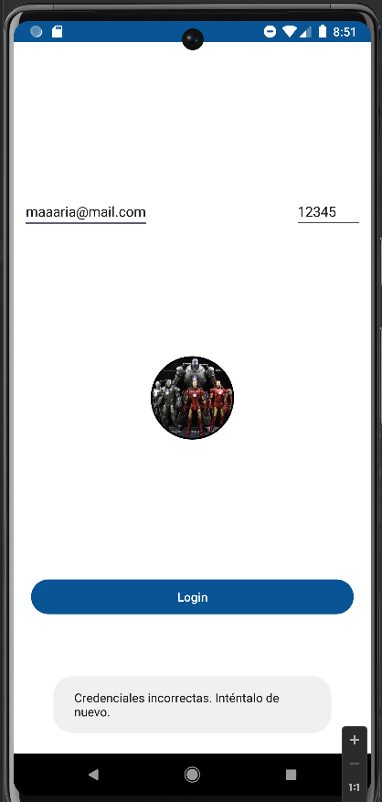
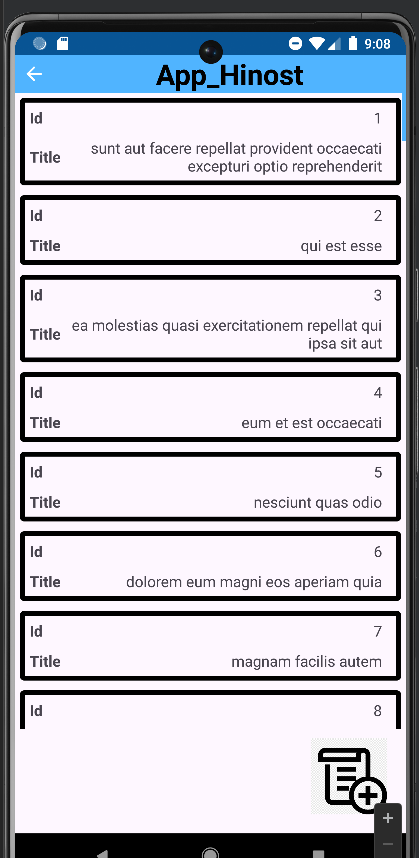
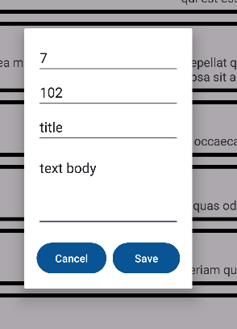
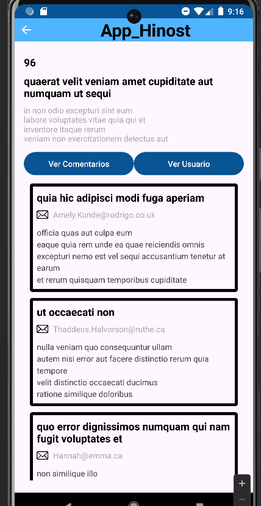
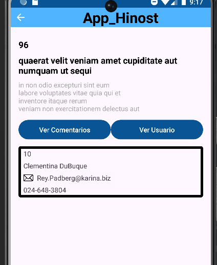

## Login
- Nuestra app esta usando el endPoint `https://api.escuelajs.co/api/v1/auth/login` de platzy para validar credenciales
- Podemos validar diferentes usuarios los mismos que encontramos en `https://api.escuelajs.co/api/v1/users`, un ejemplo es el siguiente: 
`{"email": "maria@mail.com",
  "password": "12345"
  }`
- En caso de no ser las credenciales correctas, los saldra un pequeno mensaje como en la siguiente captura de imagen:

## Seleccion de Post 
- Los recursos para los Post los estamos usando de `https://jsonplaceholder.typicode.com/`
- Una vez logueado, podremos observar la lista de Posts y boton para crear un nuevo post
- Cada item es seleccionable para acceder a la siguiente pantalla 

- Una vez dado clic en el icono de AddPost observaremos se nos abre una ventana para crear en nuevo post
- Se sugiere colocar el idUser 1-10, para tener como user una ya registrado

- Observamos que se actualiza nuestra lista de Posts con el nuevo post que hemos creado

## Detalles del Post
- Al dar clic en cualquier post, accederemos a la siguiente pantalla para observar los detalles del post seleccionado
- Al dar clic en cualquier de los botones `Ver comentarios` o `Ver Usuario` se nos mostrara la informacion correspondiente

     

